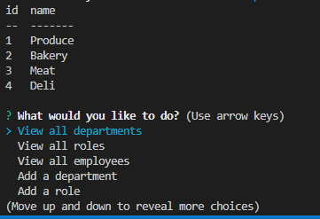
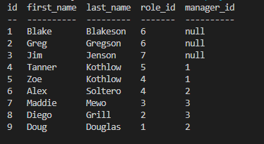
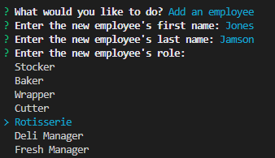
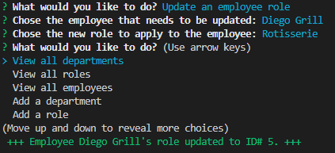
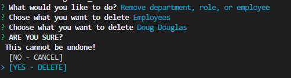

# Week 12: Employee Database

## Description

For our 11th week in our coding bootcamp, we were to work with mysql2 and Inquirer to create a javascript application that could interact and preform CRUD operations on an employee database. We were to initialize and seed the database, as well as create the application from the ground up without any starter code.

The obvious two things to do right off the bat were to get *schema.sql* and *seeds.sql* created, and to write an initial Inquirer prompt that branched into more specific functions. Creating the database was simple as can be, we've had a whole week of working with basic .sql files. Likewise we've done many, many projects with Inquirer by this point so that could also be done and out of the way. After a while I had a substantial framework that I could begin adding functionality to. To keep the Inquirer file clear, a helper file was added to store a connection to the database as well as house all the calls we'd ever need to do.

From the get-go I realized that the data needed for a number of prompts could be condensed into just a view functions. For example: if there's already a function that returns object data for a *View all employees* prompt, couldn't I, in the same function, manipulate the data slightly to send back an array of employee names. Thus dbFunc.showAll(table, returnArray, managerCall) became a real work horse for the application. Whenever I needed to view all table data, whenever I needed an array of elements for an Inquirer prompt, whenever I needed the names of all managers, all I had to was pass different parameters into dbFunc.showAll() and it would preform just a single master query to the database. I think out of everything in the project, the polymorphism for that function is what I'm most proud of. It's so simple and not even that much code, but it saved an immense amount of work later down the line.

Then came a major roadblock. database queries, much like API calls, are asynchronus functions that cannot be executed instantly like normal javascript code. So *promises* had to be factored in. My lack of confidence in how well I knew how to use promises, coupled with the fact that mysql2 comes with it's own method of delcaring promises, this challenge began to feel extremely overwhelming. Wrapping the basic view functions in a promise worked fine enough, and the functions that inserted or updated a table could be initialized while the prompt continued on. But then seemingly out of nowhere, default javascript promises just stopped working for the *View employees by manager* function. The function itself worked perfectly fine, but somehow, someway, a declared promise wasn't being respected. After hours of *dread* and trying to fix possible invisible syntax errors (something sql seems to be prone to), an answer finally presented itself. Using *await* in the mysql query function, declaring a constant that *awaits* a query completely fixed the problem. For one reason or another, *await* did what entire promise blocks could not. Not only did *await* completely solve the problem, but it was only one line of code. Opposed to a promise.then()'s 6 or so lines. Very satisfying.

After having solved the terrors of promises, it was pretty smooth sailing from then on out. Database queriess are more or less an API call when it comes to general syntax and how the response data is handled, so managing and parsing the data was no trouble at all. Plenty of code and procedures could be recycled from previous functions. It is immesnly satisfying when a project demistifies itself and working to create to new functions becomes as natural as riding a bike. In fact, it became so natural that I spend the better part of a free Sunday completing all *five* bonus prompts!

## Installation

Once you have the repo cloned to your machine, run **npm i** to instal all the needed dependencies.

Then to initialize the database, open **./db** in an integrated terminal and login to mysql using **mysql -u root -p** or an appropriate equivilent. Then **source schema.sql;** to create the bigstore_db database. **Any preexisting database named bigstore_db will be dropped**. Once bigstore_db is created, enter **source seeds.sql;** to populate the department, role, and employee tables with starter entries.

To allow mysql2 to interact with the newly created database, rename **.env.EXAMPLE** to just **.env**. Then fill in your mysql password for **DB_PASSWORD** and the user for **DB_USER** (DB_USER will most likely be 'root').

Lastly, to run the application, navigate your integrated terminal to the root folder **/week-12-employee-database** and run **node index.js**.

## Usage

- Once you have run node index.js, you will be presented with a list of options to interact with the bigstore_db database.

- There are a number of options to view the table data of bigstore_db. Chosing to view departments, roles, or employees will present you with a table of ALL relevent queries.

- Employees with a manager_id of null are assumed to be managers themselves.

- Chosing to view the combined staff and salary of a given department will present the user with all departments in the department table. This function may throw an error if there are no roles assigned to that department, and/or no employees assigned to any of that department's roles.

- To add to the database, chose any of the relevant add prompts. New departments require just a name, new roles require a name, salary, and a department assigned to them from a list. New employees require a first name, last name, role, and a manager. If an employee is added with the 'None' option for their manager, their manager_id will be set to null, and all subsequent functions will consider that employee a manager. All added elements will be assigned an incremental ID automatically.

- To update an employee's role or manager, select the relevant option from the list. You will be presented with a list of all employees and then a list of all roles/managers. Once confirmed, the employee will have their information updated. You can double check that the query was succesfull with the *View all employees* prompt.

- To delete an element, select the *Remove department, role, or employee* option. You will be presented with a list of all relevant table entires. You will then be prompted to confirm this action, chose *No* to cancel the deletion, and chose *Yes* to confirm. The cursor's default position will be on *No* in order to prevent accidental confirmations.

- It is recommended that you reassign roles and managers *before* any deletions take place. If you delete a manager, all employees previously under them will now a manager_id of null, meaning the app will consider them a manager. Likewise deleting a role will leave an employee's role_id null, which can result in errors.

- To view a more in depth instruciton video, follow [this link]().

## License and Credit

Standard MIT license, coursework.

This project makes use of the [mysql2](https://www.npmjs.com/package/mysql2), [inquirer](https://www.npmjs.com/package//inquirer), [dotenv](https://www.npmjs.com/package/dotenv?ref=hackernoon.com), and [console.table](https://www.npmjs.com/package/console.table) packages.