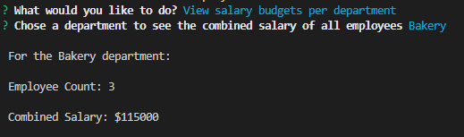

# Week 12: Employee Database

## Description

## Installation

Once you have the repo cloned to your machine, run **npm i** to instal all the needed dependencies.

Then to initialize the database, open **./db** in an integrated terminal and login to mysql using **mysql -u root -p** or an appropriate equivilent. Then **source schema.sql;** to create the bigstore_db database. **Any preexisting database named bigstore_db will be dropped**. Once bigstore_db is created, enter **source seeds.sql;** to populate the department, role, and employee tables with starter entries.

To allow mysql2 to interact with the newly created database, rename **.env.EXAMPLE** to just **.env**. Then fill in your mysql password for **DB_PASSWORD** and the user for **DB_USER** (DB_USER will most likely be 'root').

Lastly, to run the application, navigate your integrated terminal to the root folder **/week-12-employee-database** and run **node index.js**.

## Usage

## License and Credit

Standard MIT license, coursework.

This project makes use of the [mysql2](https://www.npmjs.com/package/mysql2), [inquirer](https://www.npmjs.com/package//inquirer), [dotenv](https://www.npmjs.com/package/dotenv?ref=hackernoon.com), and [console.table](https://www.npmjs.com/package/console.table) packages.